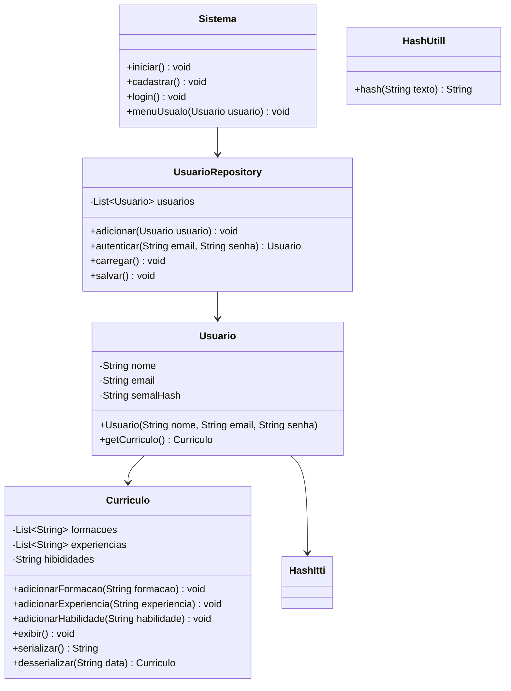

```mermaid
classDiagram
    class Curriculo {
        -List~String~ formacoes
        -List~String~ experiencias
        -String hibididades
        +adicionarFormacao(String formacao) void
        +adicionarExperiencia(String experiencia) void
        +adicionarHabilidade(String habilidade) void
        +exibir() void
        +serializar() String
        +desserializar(String data) Curriculo
    }

    class Usuario {
        -String nome
        -String email
        -String semalHash
        +Usuario(String nome, String email, String senha)
        +getCurriculo() Curriculo
    }

    class Sistema {
        +iniciar() void
        +cadastrar() void
        +login() void
        +menuUsualo(Usuario usuario) void
    }

    class UsuarioRepository {
        -List~Usuario~ usuarios
        +adicionar(Usuario usuario) void
        +autenticar(String email, String senha) Usuario
        +carregar() void
        +salvar() void
    }

    class HashUtill {
        +hash(String texto) String
    }

    Usuario --> Curriculo
    Sistema --> UsuarioRepository
    UsuarioRepository --> Usuario
    Usuario --> HashItti
```
